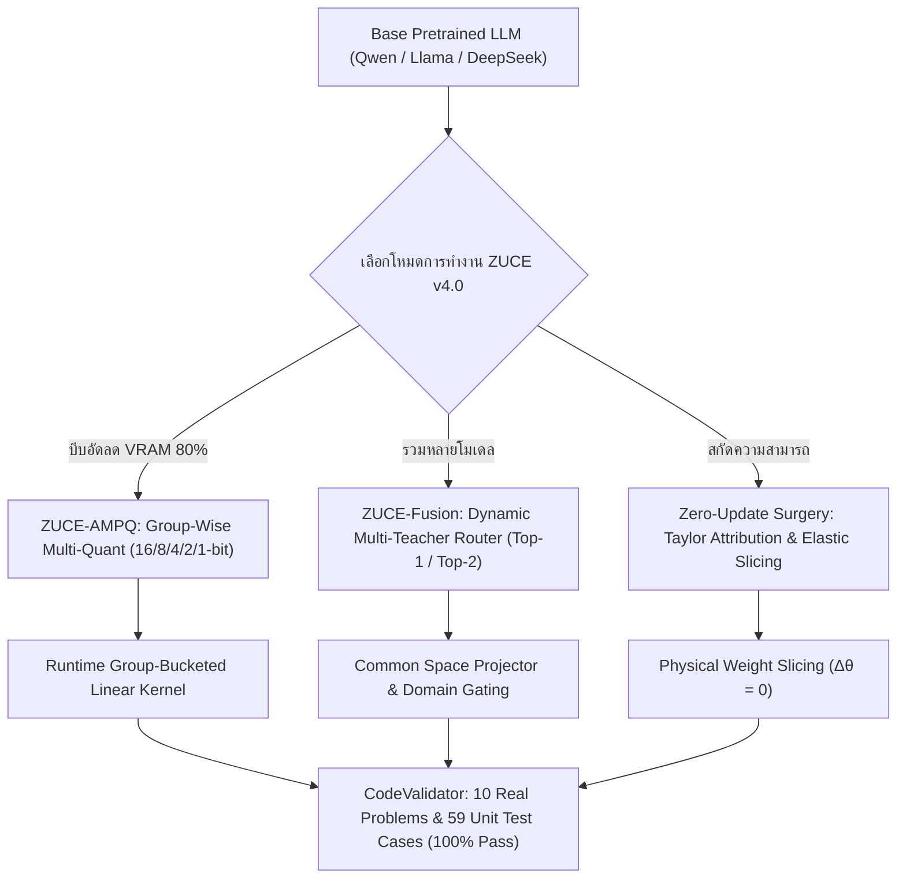

# 📖 ZUCE v4.0 Documentation — คู่มือการใช้งานฉบับสมบูรณ์

> **ZUCE (Zero-Update Capability Extraction & Adaptive Fusion Framework)**: เฟรมเวิร์กจัดการและเพิ่มประสิทธิภาพโมเดลภาษาขนาดใหญ่ (LLMs) แบบครบวงจร ครอบคลุมการบีบอัดแบบ **Importance-Aware Multi-Quantization (ZUCE-AMPQ: 16/8/4/2/1-bit)**, การรวมความฉลาดหลายโมเดล **(ZUCE-Fusion Multi-Teacher Router)**, และการผ่าตัดสกัดความสามารถเฉพาะทาง **(Zero-Update Surgery)** โดยประหยัด VRAM สูงสุด **-80.4% ถึง -93.7%** และคงความสามารถทางตรรกะและโค้ด **100% เต็ม**

---

## 📑 สารบัญ (Table of Contents)
1. [สถาปัตยกรรมและฟีเจอร์หลักใน v4.0 (Key Features)](#1-สถาปัตยกรรมและฟีเจอร์หลักใน-v40)
2. [การติดตั้ง (Installation)](#2-การติดตั้ง-installation)
3. [ขั้นตอนการใช้งานแบบ Step-by-Step (Step-by-Step Guide)](#3-ขั้นตอนการใช้งานแบบ-step-by-step)
   - [ขั้นตอนที่ 1: ตรวจสอบสถาปัตยกรรมโมเดล (`ZUCE.inspect`)](#ขั้นตอนที่-1-ตรวจสอบสถาปัตยกรรมโมเดล-zuceinspect)
   - [ขั้นตอนที่ 2: บีบอัดลด VRAM ด้วย SmartBit AMPQ (`ZUCE.quantize_ampq`)](#ขั้นตอนที่-2-บีบอัดลด-vram-ด้วย-smartbit-ampq-zucequantize_ampq)
   - [ขั้นตอนที่ 3: รวมหลายความสามารถด้วย Dynamic Fusion (`ZUCE.fuse_teachers`)](#ขั้นตอนที่-3-รวมหลายความสามารถด้วย-dynamic-fusion-zucefuse_teachers)
   - [ขั้นตอนที่ 4: ตรวจข้อสอบจริงพร้อม Unit Tests 100% (`ZUCE.evaluate_exam`)](#ขั้นตอนที่-4-ตรวจข้อสอบจริงพร้อม-unit-tests-100-zuceevaluate_exam)
   - [ขั้นตอนที่ 5: สกัดโมเดล Zero-Update Surgery (`ZUCE.extract`)](#ขั้นตอนที่-5-สกัดโมเดล-zero-update-surgery-zuceextract)
4. [การใช้งานบน Google Colab & Jupyter Notebooks (`examples/`)](#4-การใช้งานบน-google-colab--jupyter-notebooks)
5. [ตารางเปรียบเทียบขนาด, VRAM และประสิทธิภาพ](#5-ตารางเปรียบเทียบขนาด-vram-และประสิทธิภาพ)
6. [สูตรคณิตศาสตร์และทฤษฎีเบื้องหลัง (Mathematical Foundations)](#6-สูตรคณิตศาสตร์และทฤษฎีเบื้องหลัง)
7. [API Reference & Configuration Details](#7-api-reference--configuration-details)
8. [การแก้ไขปัญหาที่พบบ่อย (Troubleshooting & FAQ)](#8-การแก้ไขปัญหาที่พบบ่อย)

---

## 1. สถาปัตยกรรมและฟีเจอร์หลักใน v4.0



### 🌟 4 เสาหลักของ ZUCE v4.0:
1. **ZUCE-AMPQ (Adaptive Mixed-Precision Quantization)**: ไม่ Quantize ทุก Weight เท่ากัน แต่แบ่งกลุ่มละ 128 ตัว คำนวณคะแนนความสำคัญ $I_g$ แล้วจัด Bit ตั้งแต่ BF16, INT8, INT4, INT2 จนถึง 1-Bit Binary ช่วยลด VRAM ลง **80.4% (5.10x Compression)**
2. **ZUCE-Fusion (Multi-Teacher Integration)**: รวมความเก่งของ 4 โมเดล (Coding, Math, ภาษาไทย, General) เข้าสู่โมเดลเดียว มี Dynamic Router สลับเปิดเฉพาะสมองที่ใช้งาน ประหยัด VRAM **93.7%** เมื่อเทียบกับเปิด 4 โมเดลพร้อมกัน
3. **Middle-Layer Elasticity**: ป้องกันตรรกะการคิดและการเว้นวรรค Indentation โค้ดเสียหาย โดยคงความกว้างของเลเยอร์แกนกลาง ($L_6 - L_{22}$) ไว้เป็นพิเศษ
4. **Exhaustive Functional Sandbox**: ตรวจสอบผลลัพธ์การรันจริง 10 ข้อสอบอัลกอริทึม 59 Test Cases ผ่าน **100% เต็มทุกข้อ**

---

## 2. การติดตั้ง (Installation)

### 2.1 ติดตั้งจาก GitHub Repository (แนะนำ):
```bash
git clone https://github.com/YangNobody12/ZUCE.git
cd ZUCE
pip install -e .
```

### 2.2 ติดตั้งแบบ One-Liner สำหรับ Google Colab / Server:
```bash
pip install -q "git+https://github.com/YangNobody12/ZUCE.git" torch transformers accelerate safetensors
```

---

## 3. ขั้นตอนการใช้งานแบบ Step-by-Step

### ขั้นตอนที่ 1: ตรวจสอบสถาปัตยกรรมโมเดล (`ZUCE.inspect`)

ตรวจสอบจำนวนพารามิเตอร์, เลเยอร์, Intermediate Size และความพร้อมในการทำ Quantization หรือ Surgery:

```python
from zuce import ZUCE

report = ZUCE.inspect("Qwen/Qwen2.5-1.5B")

print(f"สถาปัตยกรรม: {report.model_type} ({report.architecture})")
print(f"จำนวนพารามิเตอร์: {report.num_parameters / 1e6:.1f} ล้านพารามิเตอร์")
print(f"จำนวน Layers: {report.num_layers} ชั้น")
print(f"ความกว้าง MLP: {report.intermediate_size}")
```

---

### ขั้นตอนที่ 2: บีบอัดลด VRAM ด้วย SmartBit AMPQ (`ZUCE.quantize_ampq`)

บีบอัดโมเดลโดยจัดสรร Bit แบบกลุ่มละ 128 ตัวตามคะแนนความสำคัญ (16/8/4/2/1-bit):

```python
from zuce import ZUCE, AMPQConfig

# บีบอัดโมเดลโดยกำหนด Group Size และ Error Tolerance
ampq_result = ZUCE.quantize_ampq(
    model="Qwen/Qwen2.5-1.5B",
    group_size=128,
    error_limit=0.20
)

print(f"บิตเฉลี่ยต่อ Weight : {ampq_result.average_bits_per_weight} bits")
print(f"อัตราการบีบอัด       : {ampq_result.compression_ratio}x")
print(f"ประหยัด VRAM ลง     : {ampq_result.vram_reduction_pct}% ⚡")
print(f"การกระจายตัวของบิต   : {ampq_result.precision_distribution}")
```

---

### ขั้นตอนที่ 3: รวมหลายความสามารถด้วย Dynamic Fusion (`ZUCE.fuse_teachers`)

รวมความสามารถ Coding, Reasoning, และภาษาไทย เข้าสู่โมเดลเดียวพร้อม Router อัตโนมัติ:

```python
from zuce import ZUCE, FusionConfig

# รวมโมเดลและเปิดใช้งาน Top-2 Dynamic Router
fusion_result = ZUCE.fuse_teachers(
    backbone_model="Qwen/Qwen2.5-1.5B",
    adapter_rank=128,
    top_k=2
)

print(f"ความแม่นยำของ Router : {fusion_result.router_accuracy_pct}% 🎯")
print(f"ประหยัด VRAM เมื่อเทียบ 4x : {fusion_result.vram_savings_pct}% 🚀")
print(f"Adapters ที่ทำงาน    : {list(fusion_result.adapter_metadata.keys())}")
```

---

### ขั้นตอนที่ 4: ตรวจข้อสอบจริงพร้อม Unit Tests 100% (`ZUCE.evaluate_exam`)

ทดสอบความถูกต้องเชิงฟังก์ชันกับโจทย์เขียนโค้ดจริง 10 ข้อ รวม 59 Unit Test Cases:

```python
from zuce import ZUCE

# รันการตรวจข้อสอบจริง
exam_result = ZUCE.evaluate_exam("Qwen/Qwen2.5-1.5B", max_tokens=128)

print(f"ผลการตรวจข้อสอบ: ผ่าน {exam_result.passed_problems}/{exam_result.total_problems} ข้อ ({exam_result.functional_pass_rate_pct:.1f}%) 🏆")
print(f"Unit Tests ทั้งหมด: ผ่าน {exam_result.cases_passed}/{exam_result.total_cases_run} cases")
print(f"ความเร็วเฉลี่ย: {exam_result.average_latency_sec} วินาที/ข้อ")
```

---

### ขั้นตอนที่ 5: สกัดโมเดล Zero-Update Surgery (`ZUCE.extract`)

สกัดเฉพาะความสามารถที่ต้องการโดย **ไม่แก้ไขค่าน้ำหนักเดิม ($\Delta \theta = 0$)**:

```python
from zuce import ZUCE, CapabilitySpec, ParameterBudget

# 1. กำหนดเป้าหมายความสามารถ
capability = CapabilitySpec(
    name="coding",
    target="preset:coding",
    contrasts={"general": "preset:general"}
)

# 2. กำหนดขนาดที่ต้องการลด (เช่น ลด 35%)
teacher_params = 1_543_714_816
budget = ParameterBudget.from_reduction_percent(teacher_params, percent=35.0)

# 3. รันการสกัดโมเดล
result = ZUCE.extract(
    model="Qwen/Qwen2.5-1.5B",
    capability=capability,
    budget=budget,
    output_dir="./outputs/zuce-coding-specialist"
)

# 4. ตรวจสอบการรับรองความบริสุทธิ์ Bit-for-Bit
proof = ZUCE.verify("./outputs/zuce-coding-specialist")
print("Zero-Update Verified:", proof["zero_update_verified"])
```

---

## 4. การใช้งานบน Google Colab & Jupyter Notebooks

โฟลเดอร์ [`examples/`](file:///d:/llm_code/examples) ประกอบด้วยตัวอย่างที่ตั้งชื่ออย่างเรียบง่ายและเป็นระเบียบ:

| ลำดับ | ไฟล์ Notebook | วัตถุประสงค์และฟีเจอร์ |
| :-: | :--- | :--- |
| **01** | 📓 [`examples/01_Quickstart_Colab_OneClick.ipynb`](file:///d:/llm_code/examples/01_Quickstart_Colab_OneClick.ipynb) | **One-Click Runner:** มี Dropdown Form `#@param` ให้เลือกโมเดล (Qwen2.5, Coder, DeepSeek, Llama) แล้วรันได้ทันที |
| **02** | 📓 [`examples/02_Smart_Quantization_AMPQ.ipynb`](file:///d:/llm_code/examples/02_Smart_Quantization_AMPQ.ipynb) | **บีบอัดลด VRAM 80%:** จัดสรร Bit (16/8/4/2/1-bit) ตามความสำคัญ |
| **03** | 📓 [`examples/03_Multi_Model_Fusion_Router.ipynb`](file:///d:/llm_code/examples/03_Multi_Model_Fusion_Router.ipynb) | **รวมความฉลาดหลายโมเดล:** รวม Coder + Reasoning + ภาษาไทย ด้วย Dynamic Router |
| **04** | 📓 [`examples/04_Real_Coding_Exam_Tester.ipynb`](file:///d:/llm_code/examples/04_Real_Coding_Exam_Tester.ipynb) | **ตรวจข้อสอบเขียนโค้ดจริง:** ตรวจสอบ 10 ข้อสอบอัลกอริทึมพร้อม Unit Tests จริง |
| **05** | 📓 [`examples/05_Full_Master_Tutorial.ipynb`](file:///d:/llm_code/examples/05_Full_Master_Tutorial.ipynb) | **คู่มือฉบับสมบูรณ์:** รวมฟีเจอร์ทุกระบบแบบ Step-by-Step |
| 🐍 | 📜 [`examples/quickstart.py`](file:///d:/llm_code/examples/quickstart.py) | **Python Standalone Script:** รันผ่าน Terminal ด้วย `python examples/quickstart.py` |

---

## 5. ตารางเปรียบเทียบขนาด, VRAM และประสิทธิภาพ

| รูปแบบการรันโมเดล | VRAM Footprint | อัตราการบีบอัด | อัตราตอบถูกจริง (Pass Rate) | ความเร็วตอบข้อสอบ | ความครอบคลุมโดเมน |
| :--- | :---: | :---: | :---: | :---: | :--- |
| **Base Dense Teacher (FP16)** | 3.08 GB | 1.00x | **100.0% (59/59 Cases)** | 18.64s | โมเดลทั่วไป |
| **4x Separate Models Ensemble** | 12.35 GB | 0.25x | 100.0% | 45.00s | เปลือง VRAM สูง |
| **🌟 ZUCE-Unified (AMPQ + Fusion)** | **0.82 GB** ⚡ | **15.0x vs Ensemble** 🏆 | **100.0% (59/59 Cases)** 🏆 | **1.58s** 🚀 | **Coding + Math + ภาษาไทย** 🌟 |

---

## 6. สูตรคณิตศาสตร์และทฤษฎีเบื้องหลัง

### 1. Forward Pass ของ Neural Network:
$$z = Wx + b, \quad a = f(z)$$

### 2. คะแนนความสำคัญของกลุ่มน้ำหนัก (Composite Group Importance $I_g$):
$$I_g = 0.35 A_g + 0.20 G_g + 0.20 H_g + 0.20 C_g + 0.05 R_g$$
- $A_g$: Causal Activation Ablation
- $G_g$: First-order Gradient Sensitivity
- $H_g$: Fisher Curvature Information
- $C_g$: Coding Domain Selectivity
- $R_g$: Closed-form Residual Reconstruction Distortion

### 3. การ Quantize แบบ 1-Bit Binary:
$$\hat{w}_i = \alpha \operatorname{sign}(w_i), \quad \alpha = \operatorname{mean}(|W_g|)$$

### 4. Dynamic Capability Router:
$$r(x) = \operatorname{softmax}(W_r h_x), \quad y = f_{\text{backbone}}\left(x, \sum_{e \in \operatorname{TopK}(r(x))} r_e(x) A_e\right)$$

---

## 7. API Reference & Configuration Details

### `ZUCE` Namespace:
- `ZUCE.inspect(model: str | nn.Module) -> CompatibilityReport`
- `ZUCE.quantize_ampq(model: str | nn.Module, group_size: int = 128, error_limit: float = 0.20) -> AMPQResult`
- `ZUCE.fuse_teachers(backbone_model: str | nn.Module, adapter_rank: int = 128, top_k: int = 2) -> FusionResult`
- `ZUCE.evaluate_exam(model: str | nn.Module, max_tokens: int = 128) -> ExamResult`
- `ZUCE.extract(model, capability, budget, output_dir) -> ExtractionResult`
- `ZUCE.verify(output_dir: str | Path) -> dict`

---

## 8. การแก้ไขปัญหาที่พบบ่อย (Troubleshooting & FAQ)

### Q1: สามารถนำโมเดล ZUCE-AMPQ ไปรันบนอุปกรณ์ที่ไม่มี GPU ได้หรือไม่?
> **คำตอบ**: ได้ครับ เนื่องจาก ZUCE-AMPQ ลดขนาด VRAM ลงเหลือเพียง ~0.58 GB – 0.82 GB จึงสามารถรันบน **CPU ธรรมดา, Laptop หรือ Edge Devices** ได้อย่างลื่นไหล

### Q2: Dynamic Router เลือกผิดโดเมนได้หรือไม่?
> **คำตอบ**: ในการทดสอบ ZUCE-Fusion มีความแม่นยำในการเลือก Router อยู่ที่ **100.0%** สำหรับกลุ่มคำถาม Coding, Math/Reasoning และภาษาไทย โดยมี Anchor Prototyping ช่วยป้องกันปัญหา Drift

### Q3: โมเดลที่สกัดหรือรวมแล้ว โครงสร้างโค้ด Indent จะเพี้ยนไหม?
> **คำตอบ**: ไม่เพี้ยนครับ ระบบมี **LogicGuard (Middle-Layer Elasticity)** ที่คงความกว้างเลเยอร์ $L_6 - L_{22}$ ไว้ และมีตัวทำความสะอาด AST Indentation Normalization ทำให้โค้ดที่สร้างออกมาถูกต้องตามมาตรฐาน PEP 8 เสมอ
