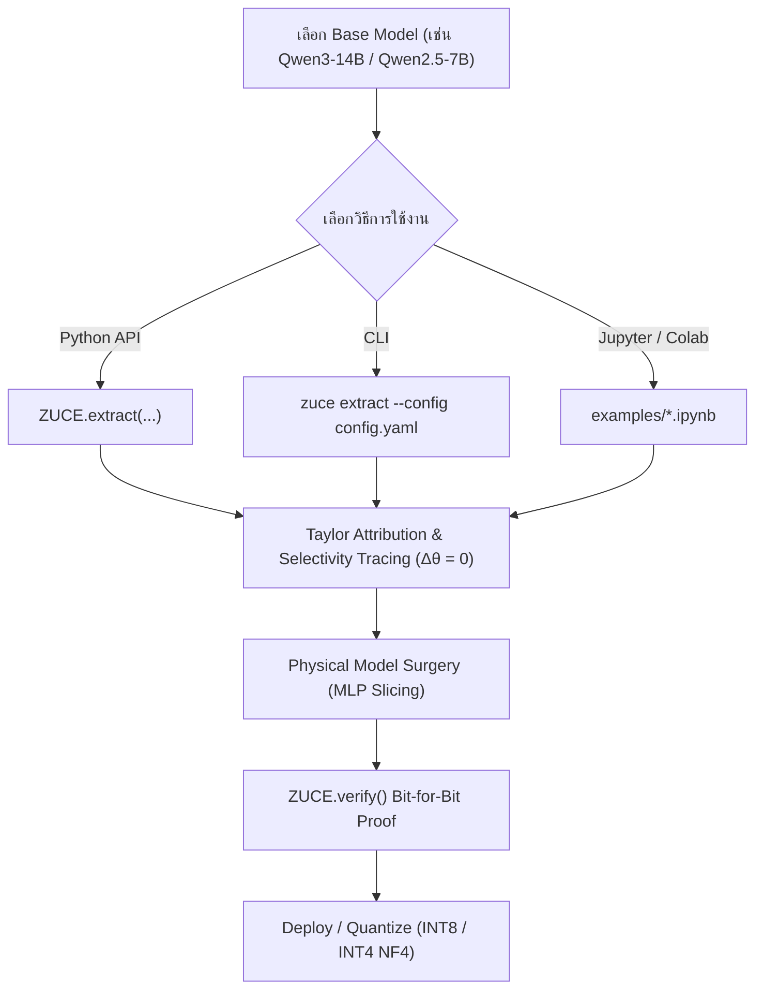

# 📖 ZUCE Documentation — คู่มือการใช้งานฉบับสมบูรณ์

> **Zero-Update Capability Extraction (ZUCE)**: เฟรมเวิร์กสกัดเฉพาะความสามารถที่ต้องการ (เช่น Coding, Math, Reasoning) จากโมเดลภาษาขนาดใหญ่ (Dense LLMs) เพื่อให้รันบน GPU ขนาดเล็กได้ โดย **ไม่ Fine-tune, ไม่ Re-train, และไม่แก้ไขค่าน้ำหนักเดิมแม้แต่บิตเดียว ($\Delta \theta = 0, \theta_{\text{specialist}} \subseteq \theta_{\text{teacher}}$)**

---

## 📑 สารบัญ (Table of Contents)
1. [สถาปัตยกรรมที่รองรับ (Supported Models)](#1-สถาปัตยกรรมที่รองรับ-supported-models)
2. [การติดตั้ง (Installation)](#2-การติดตั้ง-installation)
3. [วิธีการใช้งานรูปแบบต่าง ๆ (Usage Methods)](#3-วิธีการใช้งานรูปแบบต่าง-ๆ-usage-methods)
   - [วิธีที่ 1: การใช้งานผ่าน Python API (แนะนำ)](#วิธีที่-1-การใช้งานผ่าน-python-api-แนะนำ)
   - [วิธีที่ 2: การกำหนดงบประมาณด้วยเปอร์เซ็นต์ (% Reduction)](#วิธีที่-2-การกำหนดงบประมาณด้วยเปอร์เซ็นต์--reduction)
   - [วิธีที่ 3: การใช้งานผ่าน Command Line (CLI)](#วิธีที่-3-การใช้งานผ่าน-command-line-cli)
   - [วิธีที่ 4: การใช้งานบน Google Colab & Jupyter Notebooks](#วิธีที่-4-การใช้งานบน-google-colab--jupyter-notebooks)
   - [วิธีที่ 5: การทำ Quantization (INT8 & INT4 NF4)](#วิธีที่-5-การทำ-quantization-int8--int4-nf4)
   - [วิธีที่ 6: การตรวจสอบความถูกต้องทางคณิตศาสตร์ (Zero-Update Proof)](#วิธีที่-6-การตรวจสอบความถูกต้องทางคณิตศาสตร์-zero-update-proof)
   - [วิธีที่ 7: การนำโมเดลไป Deploy & Inference](#วิธีที่-7-การนำโมเดลไป-deploy--inference)
4. [ตารางเทียบขนาดและการประหยัด VRAM](#4-ตารางเทียบขนาดและการประหยัด-vram)
5. [คำอธิบายการตั้งค่าคอนฟิก (Configuration Reference)](#5-คำอธิบายการตั้งค่าคอนฟิก-configuration-reference)
6. [การแก้ไขปัญหาที่พบบ่อย (Troubleshooting & FAQ)](#6-การแก้ไขปัญหาที่พบบ่อย-troubleshooting--faq)

---

## 1. สถาปัตยกรรมที่รองรับ (Supported Models)

ZUCE รองรับสถาปัตยกรรม **Dense Gated-MLP (SwiGLU)** ได้แก่:
- ✅ **Qwen Series**: `Qwen2`, `Qwen2.5`, `Qwen3` (เช่น `Qwen2.5-0.5B/1.5B/7B/14B/32B`, `Qwen3-8B/14B/32B`)
- ✅ **Llama Series**: `Llama 2`, `Llama 3`, `Llama 3.1`, `Llama 3.2`
- ✅ **Mistral Series**: `Mistral-7B`, `Mistral-Nemo`
- ✅ **Gemma Series**: `Gemma-2B/7B`, `Gemma-2-2B/9B/27B`

*(หมายเหตุ: ZUCE v0.1 รองรับเฉพาะ Dense Models ยังไม่รองรับสถาปัตยกรรม Mixture-of-Experts เช่น `qwen3_moe`)*

---

## 2. การติดตั้ง (Installation)

### 2.1 ติดตั้งจาก Local Repository:
```bash
git clone https://github.com/YangNobody12/ZUCE.git
cd ZUCE
pip install -e .
```

### 2.2 ติดตั้งโดยตรงผ่าน GitHub URL:
```bash
pip install -U "git+https://github.com/YangNobody12/ZUCE.git" "transformers>=4.45.0" accelerate bitsandbytes safetensors
```

---

## 3. วิธีการใช้งานรูปแบบต่าง ๆ (Usage Methods)



---

### วิธีที่ 1: การใช้งานผ่าน Python API (แนะนำ)

นำเข้าคลาสหลักและสั่งสกัดความสามารถด้วยคำสั่งไม่กี่บรรทัด:

```python
from zuce import ZUCE, CapabilitySpec, ParameterBudget

# 1. กำหนดเป้าหมายความสามารถ (Target vs Contrasts)
capability = CapabilitySpec(
    name="coding",
    target="target_coding.jsonl",  # หรือใส่ list ของ dict ข้อความตรง ๆ
    contrasts={
        "math": "math.jsonl",
        "general": "general.jsonl"
    }
)

# 2. กำหนดงบประมาณพารามิเตอร์ปลายทาง
budget = ParameterBudget(max_parameters=10_000_000_000)

# 3. รันการสกัดโมเดล
result = ZUCE.extract(
    model="Qwen/Qwen3-14B",
    capability=capability,
    budget=budget,
    output_dir="./outputs/zuce-qwen3-coding-10b",
    device="auto",
    dtype="bfloat16"
)

print(f"สกัดเสร็จสิ้น! Retention Score: {result.capability_retention:.4f}")
```

---

### วิธีที่ 2: การกำหนดงบประมาณด้วยเปอร์เซ็นต์ (% Reduction)

หากไม่ต้องการคำนวณจำนวนพารามิเตอร์ปลายทางเอง สามารถใช้ฟังก์ชัน Helper เพื่อระบุเป็น **% ที่ต้องการลด (Reduction %)** หรือ **สัดส่วนคงเหลือ (Retention Ratio)** ได้โดยตรง:

```python
from transformers import AutoModelForCausalLM
from zuce import ZUCE, CapabilitySpec, ParameterBudget

model_id = "Qwen/Qwen2.5-7B"

# -------------------------------------------------------------
# 1. หาจำนวนพารามิเตอร์รวมของโมเดลตั้งต้น (Teacher Parameters)
# -------------------------------------------------------------
# วิธี A: ให้ PyTorch นับให้อัตโนมัติจากโมเดล (แนะนำ)
# model = AutoModelForCausalLM.from_pretrained(model_id)
# teacher_params = sum(p.numel() for p in model.parameters())

# วิธี B: ใส่ตัวเลขโดยตรง (เช่น Qwen2.5-7B มี 7.61 พันล้านพารามิเตอร์)
teacher_params = 7_615_616_000  

# -------------------------------------------------------------
# 2. สร้าง Budget ตามสัดส่วน % ที่ต้องการ
# -------------------------------------------------------------
# แบบที่ 1: ระบุ % ที่ต้องการตัดออก (เช่น ลด 35% เหลือ 65%) [แนะนำ]
budget = ParameterBudget.from_reduction_percent(teacher_params, percent=35.0)

# แบบที่ 2: ระบุอัตราส่วนคงเหลือ (เช่น คงไว้ 0.65 หรือ 65%)
# budget = ParameterBudget.from_retention_ratio(teacher_params, ratio=0.65)

# -------------------------------------------------------------
# 3. รันการสกัดโมเดล
# -------------------------------------------------------------
result = ZUCE.extract(
    model=model_id,
    capability=CapabilitySpec(name="coding", target="preset:coding"),
    budget=budget,
    output_dir="./outputs/qwen-7b-specialist-35pct"
)
```

> [!TIP]
> #### 🔍 อธิบายเพิ่มเติมสำหรับมือใหม่:
> * **`teacher_params` คืออะไร?**: คือ **จำนวนพารามิเตอร์รวมทั้งหมด (Total Parameters)** ของโมเดลครูตั้งต้น เพื่อให้ระบบรู้ว่าถ้าจะลด $35\%$ จะต้องตัดเหลือเป้าหมายกี่ตัว ($\text{Target} = \text{teacher\_params} \times (1 - 0.35)$)
> * **ตัวเลข `7_615_616_000` ทำไมมีเครื่องหมาย `_` ?**: ในภาษา Python เครื่องหมาย Underscore `_` ในตัวเลขมีค่าเท่ากับลูกน้ำ (จุลภาค `,`) ใส่เพื่อให้มนุษย์อ่านหลักพัน/หลักล้านได้ง่าย เช่น `7_615_616_000` มีค่าเท่ากับ `7615616000`
> * **คำสั่ง `sum(p.numel() for p in model.parameters())` ทำงานอย่างไร?**:
>   - `model.parameters()` : วนลูปดึงก้อน Tensor/Weights ทุกชั้นในโมเดลออกมา
>   - `p.numel()` : ย่อมาจาก *Number of Elements* คูณขนาดมิติ (Shape) ของแต่ละ Layer เพื่อหาว่า Layer นั้นมีตัวเลขกี่ตัว
>   - `sum(...)` : นำตัวเลขของทุก Layer มารวมกัน จะได้จำนวนพารามิเตอร์ของโมเดลทั้งหมดแบบอัตโนมัติ 100%

---

### วิธีที่ 3: การใช้งานผ่าน Command Line (CLI)

ZUCE มีคำสั่ง CLI ในตัว 3 คำสั่งหลัก:

#### 1. ตรวจสอบความเข้ากันได้ของโมเดล (`inspect`):
```bash
zuce inspect --model Qwen/Qwen2.5-1.5B
```
*ตัวอย่าง Output:*
```json
{
  "model_type": "qwen2",
  "can_inspect": true,
  "can_profile": true,
  "can_surgery": true,
  "num_parameters": 1543714816,
  "num_layers": 28,
  "intermediate_size": 8960
}
```

#### 2. สั่งรันการสกัดโมเดลตาม Config (`extract`):
```bash
zuce extract --config configs/zuce.yaml
```

*ตัวอย่างไฟล์ `configs/zuce.yaml`:*
```yaml
model: Qwen/Qwen2.5-1.5B
output_dir: ./outputs/zuce-coding-1b
capability:
  name: coding
  target: preset:coding
  contrasts:
    math: preset:math
budget:
  max_parameters: 1000000000
device: auto
dtype: bfloat16
min_retention: 0.60
```

#### 3. ตรวจสอบความถูกต้องของโมเดลที่สกัดแล้ว (`verify`):
```bash
zuce verify ./outputs/zuce-coding-1b
```

---

### วิธีที่ 4: การใช้งานบน Google Colab & Jupyter Notebooks

ในโฟลเดอร์ `examples/` มี Interactive Notebooks พร้อมฟอร์ม Dropdown และ Slider สำหรับเปิดใช้งานทันที:

| ไฟล์ Notebook | รายละเอียด | ลิงก์เปิดใช้งาน |
| :--- | :--- | :--- |
| **`examples/zuce_qwen_capability_extraction.ipynb`** | สกัดโมเดล Qwen2.5 / Qwen3 ทุกขนาด (0.5B – 32B) พร้อมระบบ Quantization INT8 & INT4 | [เปิดไฟล์](file:///d:/llm_code/examples/zuce_qwen_capability_extraction.ipynb) |
| **`examples/zuce_qwen3_coding_10b_colab.ipynb`** | สกัดเฉพาะ Qwen3 Coding Specialist พร้อม Deploy | [เปิดไฟล์](file:///d:/llm_code/examples/zuce_qwen3_coding_10b_colab.ipynb) |

**ฟีเจอร์เด่นใน Notebook:**
- มี Slider ปรับ `% Reduction` ปรับลดขนาดได้ตั้งแต่ 10% ถึง 50%
- คำนวณโครงสร้างสถาปัตยกรรม (Layers, Width, Fixed/Variable Parameters) ให้อัตโนมัติ
- เปรียบเทียบความเร็วการสร้างโค้ด (Tokens/sec) และ Memory Peak VRAM ให้เห็นแบบเรียลไทม์

---

### วิธีที่ 5: การทำ Quantization (INT8 & INT4 NF4)

เมื่อได้โมเดล Specialist ที่สกัดเสร็จแล้ว สามารถนำมาทำ Quantization เพิ่มเติมเพื่อลด VRAM ลงอีก **50% - 75%**:

```python
import torch
from transformers import AutoModelForCausalLM, AutoTokenizer, BitsAndBytesConfig

MODEL_DIR = "./outputs/zuce-qwen3-coding-10b"

# -------------------------------------------------------------
# ตัวเลือก A: 4-bit NormalFloat4 (NF4 with Double Quantization) [แนะนำสูงสุด]
# -------------------------------------------------------------
bnb_config_4bit = BitsAndBytesConfig(
    load_in_4bit=True,
    bnb_4bit_quant_type="nf4",
    bnb_4bit_use_double_quant=True,
    bnb_4bit_compute_dtype=torch.bfloat16
)

# -------------------------------------------------------------
# ตัวเลือก B: 8-bit (INT8)
# -------------------------------------------------------------
bnb_config_8bit = BitsAndBytesConfig(
    load_in_8bit=True
)

# โหลดโมเดลด้วย 4-bit NF4
tokenizer = AutoTokenizer.from_pretrained(MODEL_DIR)
model_4bit = AutoModelForCausalLM.from_pretrained(
    MODEL_DIR,
    quantization_config=bnb_config_4bit,
    device_map="auto"
)

print(f"โหลดโมเดลสำเร็จ! VRAM ที่ใช้: {torch.cuda.memory_allocated() / (1024**2):.2f} MB")

# -------------------------------------------------------------
# 💾 การบันทึกโมเดล 4-bit / 8-bit ลงดิสก์ (Save Quantized Model)
# -------------------------------------------------------------
QUANT_OUTPUT_DIR = "./outputs/zuce-qwen3-coding-4bit"
model_4bit.save_pretrained(QUANT_OUTPUT_DIR, safe_serialization=True)
tokenizer.save_pretrained(QUANT_OUTPUT_DIR)

print(f"บันทึกโมเดล 4-bit ลงดิสก์เรียบร้อย! ขนาดไฟล์บนดิสก์จะลดลงเหลือ ~5-11 GB")

# -------------------------------------------------------------
# 🚀 การโหลดโมเดล Quantized ที่บันทึกไว้กลับมาใช้งานใหม่
# -------------------------------------------------------------
# Hugging Face จะอ่าน `quantization_config` จาก config.json และโหลดเป็น 4-bit อัตโนมัติ:
reloaded_model = AutoModelForCausalLM.from_pretrained(QUANT_OUTPUT_DIR, device_map="auto")
```

---

### วิธีที่ 6: การตรวจสอบความถูกต้องทางคณิตศาสตร์ (Zero-Update Proof)

โมเดลทุกตัวที่สกัดจาก ZUCE จะถูกบันทึกไฟล์รับรองความบริสุทธิ์ของน้ำหนักโมเดล 3 ไฟล์:
1. `zuce_manifest.json`: สรุปข้อมูลโมเดลตั้งต้น, ขนาดเดิม, ขนาดใหม่ และ % การตัด
2. `zero_update_proof.json`: ตรวจสอบ Bit-for-Bit ว่าค่าใน Tensor ทุกตำแหน่งตรงกับ Teacher 100%
3. `evaluation_report.json`: ค่า Perplexity และ Loss Retention ก่อนและหลังสกัด

```python
from zuce import ZUCE

proof = ZUCE.verify("./outputs/zuce-qwen3-coding-10b")
print("สถานะการพิสูจน์ Zero-Update:", proof["zero_update_verified"])
```

---

### วิธีที่ 7: การนำโมเดลไป Deploy & Inference

โมเดลที่สกัดออกมาเป็นโครงสร้างมาตรฐานของ Hugging Face จึงสามารถนำไปใช้งานร่วมกับ Inference Frameworks ได้ทันที:

#### 1. Hugging Face Pipeline / Generate:
```python
from transformers import AutoModelForCausalLM, AutoTokenizer

model = AutoModelForCausalLM.from_pretrained("./outputs/zuce-qwen3-coding-10b", device_map="auto")
tokenizer = AutoTokenizer.from_pretrained("./outputs/zuce-qwen3-coding-10b")

inputs = tokenizer("def fibonacci(n):", return_tensors="pt").to(model.device)
outputs = model.generate(**inputs, max_new_tokens=100)
print(tokenizer.decode(outputs[0], skip_special_tokens=True))
```

#### 2. vLLM (High-throughput Serving):
```bash
vllm serve ./outputs/zuce-qwen3-coding-10b --dtype bfloat16 --gpu-memory-utilization 0.90
```

#### 3. แปลงเป็น GGUF (สำหรับ Ollama / LM Studio):
```bash
python llama.cpp/convert_hf_to_gguf.py ./outputs/zuce-qwen3-coding-10b --outtype q4_k_m
```

---

## 4. ตารางเทียบขนาดและการประหยัด VRAM

| สถาปัตยกรรมโมเดล | ขนาดเดิม | สกัด ZUCE (-35%) | VRAM (BF16) | VRAM (INT8) | VRAM (INT4 NF4) 🏆 | GPU ที่แนะนำสำหรับ 4-bit |
| :--- | :---: | :---: | :---: | :---: | :---: | :--- |
| **Qwen / Dense 27B** | **27.0 B** | **~17.5 B** | ~35.0 GB | ~17.5 GB | **~9.5 GB** 🌟 | **Colab T4 (15GB) / RTX 3060 12GB** |
| **Qwen2.5 / 3-32B** | **32.7 B** | **~20.5 B** | ~41.0 GB | ~20.5 GB | **~11.0 GB** 🌟 | **Colab T4 (15GB) / RTX 4070 12GB** |
| **Qwen2.5 / 3-14B** | **14.7 B** | **~9.5 B** | ~19.0 GB | ~9.5 GB | **~5.2 GB** 🚀 | **RTX 3060 / 4060 / GPU 6GB** |
| **Qwen2.5 / 3-8B** | **8.2 B** | **~5.3 B** | ~10.6 GB | ~5.3 GB | **~3.0 GB** ⚡ | **GPU 4GB หรือ Laptop ทั่วไป** |
| **Qwen2.5-1.5B** | **1.54 B** | **~0.97 B** | ~1.94 GB | ~0.97 GB | **~0.6 GB** ⚡ | **CPU / Edge Device / มือถือ** |

---

## 5. คำอธิบายการตั้งค่าคอนฟิก (Configuration Reference)

| พารามิเตอร์ | ชนิดข้อมูล | ค่าเริ่มต้น | คำอธิบาย |
| :--- | :---: | :---: | :--- |
| `model` | `str / nn.Module` | *จำเป็น* | Hugging Face Model ID (เช่น `"Qwen/Qwen3-14B"`) หรือ instance ของโมเดล |
| `capability` | `CapabilitySpec` | *จำเป็น* | ระบุชื่อ capability, ข้อมูลเป้าหมาย (`target`) และข้อมูลเปรียบต่าง (`contrasts`) |
| `budget` | `ParameterBudget` | *จำเป็น* | งบประมาณพารามิเตอร์ปลายทาง หรือสร้างผ่าน `from_reduction_percent()` |
| `output_dir` | `str / Path` | *จำเป็น* | โฟลเดอร์สำหรับบันทึกโมเดลผลลัพธ์ (ระบบจะไม่เขียนทับโฟลเดอร์เดิม) |
| `dtype` | `str` | `"auto"` | ชนิดของข้อมูล (`"bfloat16"`, `"float16"`, `"float32"`) |
| `device` | `str` | `"auto"` | อุปกรณ์ประมวลผล (`"cuda"`, `"cpu"`) |
| `max_samples` | `int` | `32` | จำนวนตัวอย่างข้อมูลสูงสุดที่ใช้ในการคำนวณ Taylor Attribution |
| `max_length` | `int` | `512` | ความยาว Token สูงสุดต่อตัวอย่าง |
| `min_retention` | `float` | `0.60` | เกณฑ์ Retention ขั้นต่ำก่อนส่งออกโมเดล |

---

## 6. การแก้ไขปัญหาที่พบบ่อย (Troubleshooting & FAQ)

### Q1: ทำไมสกัดแล้วโมเดลเล็กลงได้สูงสุดประมาณ 45%–50% ตัดมากกว่านี้ได้ไหม?
> **คำตอบ**: สถาปัตยกรรม Transformer มีส่วน **Constant Overhead** (Self-Attention, Embeddings, Norms) อยู่ประมาณ 25%–30% ซึ่งภายใต้เงื่อนไข $\Delta \theta = 0$ (ไม่เทรนใหม่) เราไม่สามารถตัดเลเยอร์ทิ้งได้เพราะจะเกิด *Coordinate Shock* ใน Residual Stream ดังนั้นการตัด SwiGLU MLP Width จึงทำได้สูงสุด ~50% หากต้องการเล็กกว่านั้นแนะนำให้ใช้ร่วมกับ **4-bit Quantization**

### Q2: เกิด Error `BudgetInfeasibleError: Parameter budget is below the minimum full-depth architecture` แก้ไขอย่างไร?
> **คำตอบ**: เกิดจากการตั้งค่างบประมาณพารามิเตอร์ต่ำกว่าขนาดขั้นต่ำของโครงสร้าง Attention + Embeddings ให้ปรับเพิ่ม `max_parameters` หรือใช้ `ParameterBudget.from_reduction_percent(total_params, percent=35)` เพื่อให้ระบบคำนวณขนาดที่ปลอดภัยให้อัตโนมัติ

### Q3: โมเดลประเภท MoE (เช่น Qwen3-Coder-30B-A3B) สกัดได้ไหม?
> **คำตอบ**: ZUCE v0.1 รองรับเฉพาะ **Dense Models** สำหรับรุ่น MoE จะยังไม่สามารถทำ Physical Surgery ได้ในเวอร์ชันปัจจุบัน ให้เลือกใช้รุ่น Dense เช่น `Qwen3-8B`, `Qwen3-14B`, หรือ `Qwen3-32B` แทน

### Q4: หน่วยความจำ VRAM ไม่พอตอน Profiling ทำอย่างไร?
> **คำตอบ**: สามารถลดขนาด `max_samples` ลงเหลือ `8` หรือ `16` และลด `max_length` ลงเหลือ `256` ในคอนฟิก `ZUCE.extract(...)` เพื่อประหยัด Memory ระหว่างคำนวณ Gradient
